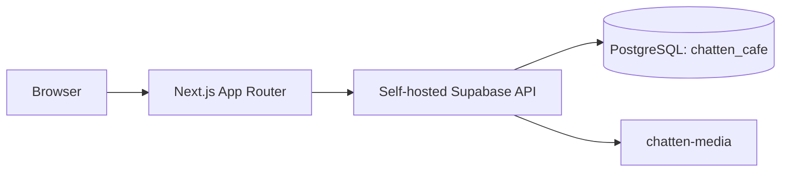

# System Design

Next.js Server Components default. Browser client uses anon key; server client uses cookie-backed auth; service-role client is server-only. Application tables live in `chatten_cafe`, inside existing self-hosted Supabase PostgreSQL. `updated_at` uses shared trigger. `price numeric(10,2)` stores currency units.

RLS permits anonymous reads only for active/published content. CMS mutations require `editor`, `admin`, or `super_admin`; user/role management requires `admin` or `super_admin`. Auth trigger creates profiles. Initial admin role bootstrap must occur through controlled database administration after Auth user creation.

`chatten-media` is public for future published web assets; sensitive assets require separate private bucket in later phase. PostgREST exposes `chatten_cafe` through `PGRST_DB_SCHEMAS`. Docker runs standalone Next.js separately from existing Supabase. Migrations remain source of truth. Risks: generated database types and full CMS controls remain Phase 4 work.

## Homepage data flow

Phase 2 homepage uses the normal server Supabase client and `chatten_cafe` RLS policies, never service-role access. It loads published/active entities for hero, moments, brand story, menu, spaces, experiences, gallery, testimonials, events/promotions, visit details, navigation, and social links. Missing rows render restrained placeholders or hide optional sections. Media records resolve to public `chatten-media` object URLs. The homepage stays dynamic so runtime environment configuration is never required during the Docker build; explicit query caching can be added when CMS publishing workflows are introduced.

## Public routes and SEO

Phase 3 adds data-driven public routes for menu, experiences, spaces, gallery, events, about, and visit. Experience, space, and event slugs resolve through RLS-safe public queries and return the branded 404 page when absent. Shared public components provide header, footer, page hero, and consistent CTA patterns. Centralized public query and data types live in `lib/public-data`; this is the maintainable schema-derived type strategy until self-hosted type generation is operationalized.

Every public page supplies descriptive metadata. Canonical and sitemap absolute URLs require `NEXT_PUBLIC_APP_URL`; when it is absent, no placeholder domain is emitted. `robots.txt` excludes admin routes. A project-owned SVG provides default OG treatment, and root JSON-LD uses only verified `WebSite` identity fields. Public media continues to use direct `chatten-media` Storage URLs with branded placeholders for absent media.

## CMS architecture

Phase 4 adds an authenticated `/admin` dashboard. A protected route group keeps `/admin/login` public while all CMS modules require a valid Supabase Auth session plus a `chatten_cafe.user_roles` record. Shared resource definitions drive table allowlists and field forms for content/settings CRUD. Server actions use the regular cookie-backed Supabase client, preserving database RLS; the server-only service-role client is limited to listing Auth users after an authorized request reaches the Users & Roles module.

The media library uploads validated images (image MIME type, 10 MB maximum) into `chatten-media`, then records metadata in `chatten_cafe.media`. Deletes are confirmed in the browser and blocked when a media record is referenced by public content. Contact data now separates `directions_url` from `map_embed_url`; the old `map_url` value is retained and backfilled into directions for compatibility.

Initial role bootstrap remains an operational database-admin step: current self-hosted Auth users have no CMS roles, so no user can enter the dashboard until a controlled super-admin assignment is made. This intentionally avoids a development bypass.
