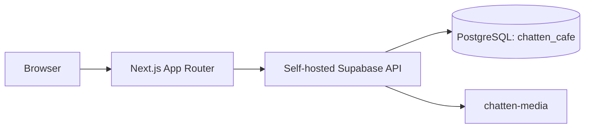

# System Design

Next.js Server Components default. Browser client uses anon key; server client uses cookie-backed auth; service-role client is server-only. Application tables live in `chatten_cafe`, inside existing self-hosted Supabase PostgreSQL. `updated_at` uses shared trigger. `price numeric(10,2)` stores currency units.

RLS permits anonymous reads only for active/published content. CMS mutations require `editor`, `admin`, or `super_admin`; user/role management requires `admin` or `super_admin`. Auth trigger creates profiles. Initial admin role bootstrap must occur through controlled database administration after Auth user creation.

`chatten-media` is public for future published web assets; sensitive assets require separate private bucket in later phase. PostgREST exposes `chatten_cafe` through `PGRST_DB_SCHEMAS`. Docker runs standalone Next.js separately from existing Supabase. Migrations remain source of truth. Risks: generated database types and full CMS controls remain Phase 4 work.

## Homepage data flow

Phase 2 homepage uses the normal server Supabase client and `chatten_cafe` RLS policies, never service-role access. It loads published/active entities for hero, moments, brand story, menu, spaces, experiences, gallery, testimonials, events/promotions, visit details, navigation, and social links. Missing rows render restrained placeholders or hide optional sections. Media records resolve to public `chatten-media` object URLs. The homepage stays dynamic so runtime environment configuration is never required during the Docker build; explicit query caching can be added when CMS publishing workflows are introduced.
